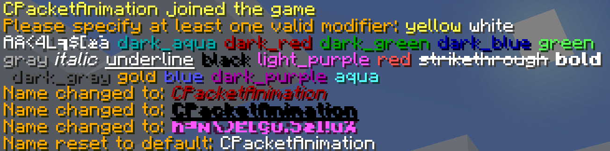

# NameColor
[](https://github.com/blockparole/LeeesNC/releases/latest)
[](https://github.com/blockparole/LeeesNC)
[](https://github.com/blockparole/LeeesNC)

##### Provides a name color self service command.




###### Usage
 - `/nc <modifiers>`
 - `/nc dark red italic`
 - `/nc aqua bold underline`
 - `/nc light_purple magic bold`
 - `/nc reset`


###### Modifiers
|Colors         |Format          |
|---------------|----------------|
|`AQUA`         |`BOLD`          |
|`BLACK`        |`ITALIC`        |
|`BLUE`         |`MAGIC`         |
|`DARK_AQUA`    |`STRIKETHROUGH` |
|`DARK_BLUE`    |`UNDERLINE`     |
|`DARK_GRAY`    |                |
|`DARK_GREEN`   |                |
|`DARK_PURPLE`  |                |
|`DARK_RED`     |                |
|`GOLD`         |                |
|`GRAY`         |                |
|`GREEN`        |                |
|`LIGHT_PURPLE` |                |
|`RED`          |                |
|`WHITE`        |                |
|`YELLOW`       |                |


###### Config
```
permission-global: namecolor.global
permission-global-required: false
permission-reset: namecolor.reset
permission-reset-required: false
save-modifiers: true
load-modifiers: true
modifier-bold-allow: true
modifier-italic-allow: true
modifier-magic-allow: false
modifier-strikethrough-allow: false
modifier-underline-allow: false
```

Player modifiers are stored in the config and referenced via UUID:
```
2a844c27-d1d2-32bd-88e9-c9fba95cf7a7: §9§c§k§l
```
